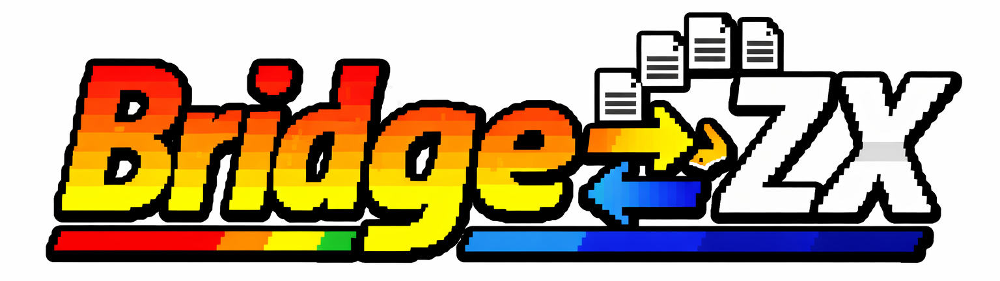

# BridgeZX File Tranfer Tool



> *Versión en español aquí: [READMEsp.md](READMEsp.md)*

**BridgeZX** is a file transfer tool designed for the ZX Spectrum that bridges the gap between your modern PC and your Spectrum ZX. It implements an **asynchronous client-server architecture** to transfer files (TAP, TRD, SCR, Z80, etc.) over Wi-Fi directly to the Spectrum's SD card.

It leverages the **ESP-12 (ESP8266)** Wi-Fi module interfacing via the **AY-3-8912** sound chip to create a wireless link, where the Spectrum acts as the receiver node (Server) and your PC as the sender (Client).

## 🚀 Features

* **"High-Speed" Transfer**: Okay, let's be real. It runs at **9600 baud** via the AY sound chip. It's blazing fast compared to waiting 5 minutes for a cassette tape load, but don't expect 5G speeds! ;)
* **Asynchronous Client-Server Architecture**: The system handles data reception, buffer management, SD writing, and UI updates asynchronously to ensure stability on the Z80 CPU.
* **Dual Operation Mode**:
    * **Dot Command (`.bridgezx`)**: The pro way. Integrates into esxDOS. Just type `.bridgezx` to launch the listening server.
    * **Standard Binary (`.bin`)**: Can be loaded via a BASIC loader or `RANDOMIZE USR`.
* **Direct SD Writing**: Uses esxDOS syscalls to write incoming data streams directly to storage, bypassing slow ROM routines.
* **Bulletproof Integrity**: Implements **CRC-16** verification for every file packet.
* **Retro-Futuristic UI**:
    * Real-time progress bar.
    * **"The Matrix" Visual Feedback**: The border flashes with binary noise during transfer, giving you hardware-level confirmation of the UART activity.
    * Color-coded status: Blue (Standby), Green (Success), Red (Error).
* **Safety First**: Pre-flight checks for free disk space and a 2MB file limit to prevent file system corruption.
* **Smart Screen Wipe**: Custom video initialization that nukes old BASIC listings from orbit, ensuring a clean interface every time.

## 🛠 Hardware Requirements

* **ZX Spectrum** (48k, 128k, +2, +3, or clones like ZX-Uno/Next).
* **Storage Interface**: DivMMC, DivIDE, or similar running **esxDOS**.
* **Wi-Fi Interface**: An **ESP-12 (ESP8266)** module connected via UART to the **AY-3-8912** chip (standard wiring for most modern ZX networking interfaces).

## 📦 Installation & Usage

### 1. The Cool Way (Dot Command)
1.  Copy the `bridgezx` file (no extension) to the `/BIN` folder of your SD card.
2.  Boot your Spectrum.
3.  Type this in BASIC and hit Enter:
    ```basic
    .bridgezx
    ```
4.  The Spectrum is now listening on **Port 6144**. Use the PC Client to send files.

### 2. The Old School Way (Binary)
1.  Copy `bridgezx.bin` and `BRIDGEZX.BAS` to your SD card.
2.  Load it like it's 1985:
    ```basic
    LOAD "BRIDGEZX.BAS"
    ```

## ⚙️ Compilation

Written in Z80 Assembly. Requires **SjASMPlus** (v1.21.0 or newer).

### Building the Dot Command (`.bridgezx`)
We use the `-DDOT` flag to relocate code to address `$2000` (esxDOS space).
```bash
sjasmplus -DDOT dot.asm
