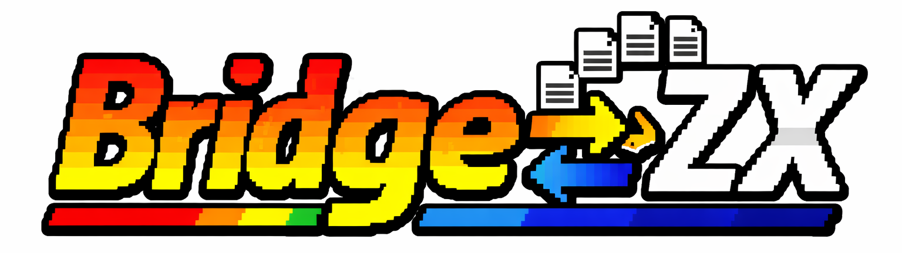

# BridgeZX File Transfer Tool



> Spanish version: [READMEsp.md](READMEsp.md)

**BridgeZX** transfers files from a Windows PC to a ZX Spectrum SD card over Wi-Fi. The Spectrum runs a small esxDOS DOT-command server, and the PC uses the PowerShell client to send one file or a full queue.

Current release: **v0.5.2**

## Features

- **divMMC / ZX-Uno UART server**: hardware UART path tuned for ESP8266 AT firmware on port `6144`.
- **esxDOS DOT command**: copy `brgzx` to `/BIN` and launch it as `.brgzx`.
- **Multi-file queue**: drag files or folders into the Windows client, reorder them, and send the batch in one TCP session.
- **Integrity checks**: each file carries a CRC-16; the client only advances after a real server ACK.
- **Direct SD writes**: the Z80 server writes payloads through esxDOS, with free-space checks and a 2 MB per-file safety limit.
- **Responsive UI**: overall progress, ETA, taskbar progress, connection probing, pauseable monitoring, and completion sound.
- **Failure-safe transfer flow**: timeouts, CRC failures, protected directories, and disk errors stop the queue instead of reporting false success.

## Hardware Requirements

- ZX Spectrum 48K/128K/+2/+3 or compatible clone.
- DivMMC/DivIDE-compatible storage running esxDOS.
- ESP8266/ESP-12 Wi-Fi module reachable through the ZX-Uno/divMMC UART path used by BridgeZX.

## Installation

### Spectrum server

1. Build or download the release asset `brgzx`.
2. Copy `brgzx` to `/BIN` on the Spectrum SD card.
3. Start it from BASIC:

```basic
.brgzx
```

The server listens on TCP port `6144`.

### Windows client

Use `client/BridgeZX_FINAL.ps1` from the release, or build it locally:

```powershell
powershell -ExecutionPolicy Bypass -File .\client\build.ps1
powershell -ExecutionPolicy Bypass -File .\client\BridgeZX_FINAL.ps1
```

## Build

Server requirements: `sjasmplus` and `make`.

```bash
cd server
make all
```

Outputs:

- `server/build/brgzx` - esxDOS DOT command
- `server/build/brgzx.bin` - raw binary build

Client bundle:

```powershell
powershell -ExecutionPolicy Bypass -File .\client\build.ps1
```

## Release Assets

A release normally ships:

- `brgzx`
- `brgzx.bin`
- `BridgeZX_FINAL.ps1`
- optionally `BridgeZX.exe` when built with ps2exe

## Notes

BridgeZX is tuned for real hardware. If transfers fail on a new ESP/UART setup, validate Wi-Fi signal, ESP AT firmware, TCP port `6144`, and SD write health before changing pacing.
